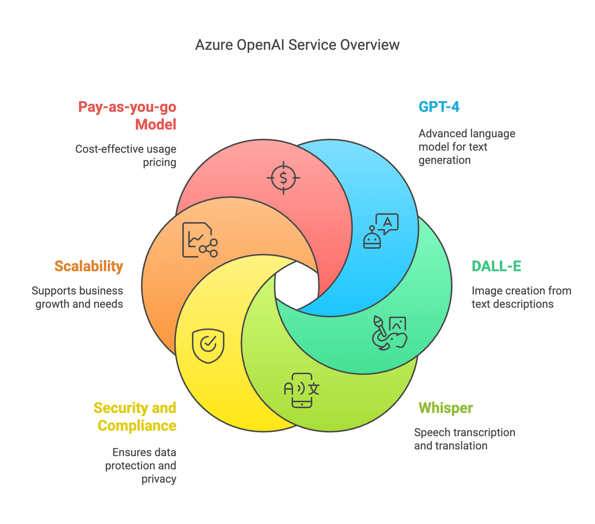
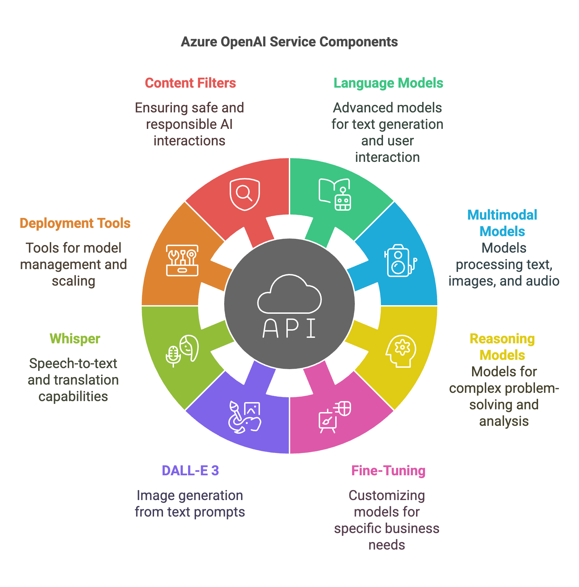
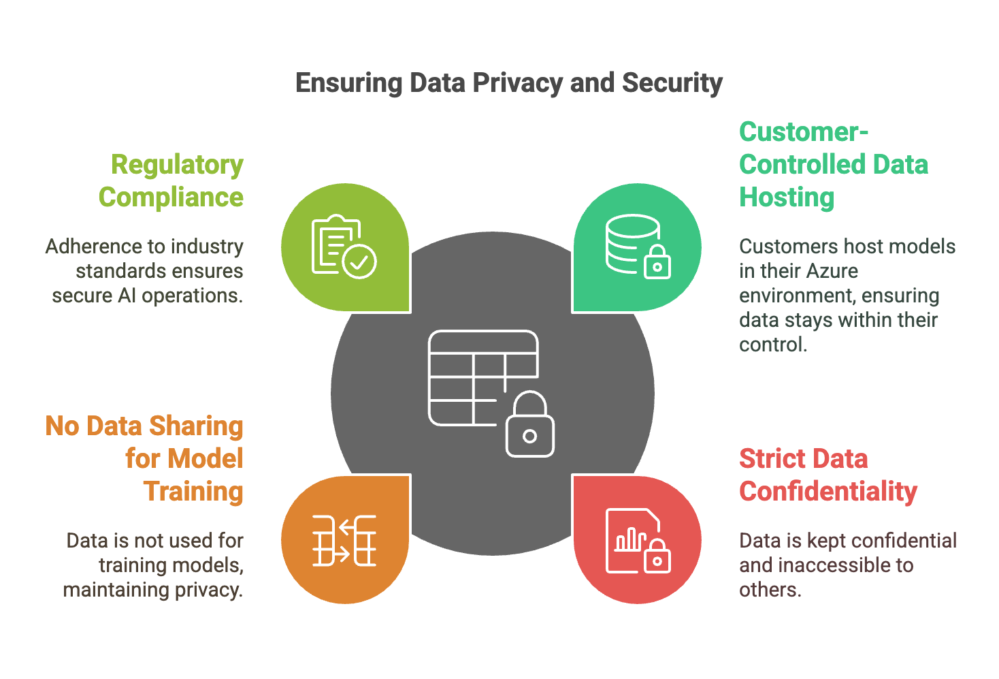
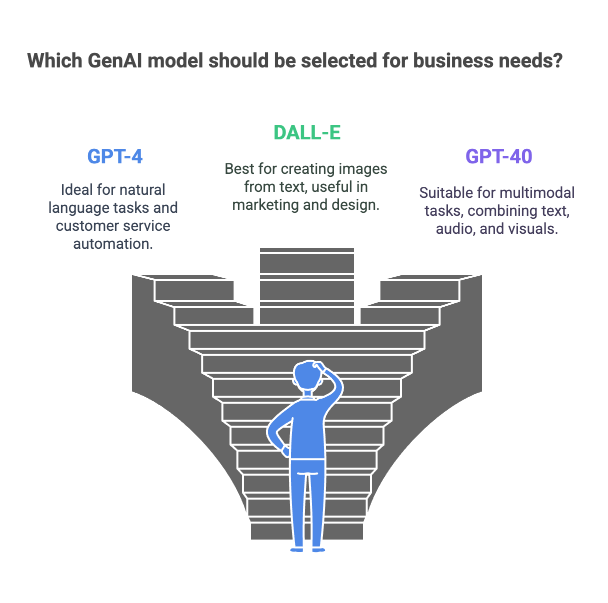

# Azure Generative AI Engineer

## Building Generative AI Applications for Data Insights on Azure
In this course, you’ll learn how to use cutting-edge AI tools on the Azure cloud platform to solve business challenges, deliver insights, boost productivity, and unlock new capabilities in areas like data analysis, customer service, and content creation.

### Introduction to Azure OpenAI Service, AI Models, and Capabilities

#### Introduction to Azure OpenAI Service

Azure OpenAI Service is a suite of tools designed to help businesses innovate faster, automate routine tasks, and operate more efficiently with the latest in AI technology, all while ensuring scalability, security, and compliance.

Imagine running a business with demanding tasks like responding to customers, generating reports, or designing visuals. The Azure OpenAI Service transforms these workflows by providing access to powerful AI models, enabling automation and enhancing productivity. With Azure OpenAI, you can use advanced models like GPT-4 for text generation, DALL-E for image creation, and Whisper for speech transcription and translation—all through Azure’s secure, cloud-based environment. No specialized hardware is needed; just access to Azure, allowing you to seamlessly integrate these capabilities into your existing business processes.

- At the core of the service is **GPT-4**, one of the most advanced language models available, which can understand and generate human-like responses. This model is ideal for tasks like drafting reports, responding to customer inquiries, or even crafting marketing content, freeing up time and reducing manual effort.
- **DALL-E** expands your creative toolkit by generating custom images from simple text descriptions, making it easier to brainstorm product designs or create social media content quickly.
- For audio processing, the **Whisper** model converts speech to text and supports multiple languages, empowering businesses to manage multilingual content and work across global markets. Azure’s Text-to-Speech service complements this by transforming written content into natural-sounding audio, enabling rapid creation of voice-activated responses or audio content.

The Azure OpenAI Service is built on Microsoft Azure’s scalable, secure infrastructure, ensuring businesses can deploy these AI capabilities confidently, whether for small startups or large enterprises. Security and compliance are integral to Azure, meeting regulatory standards to protect data and uphold privacy. With a pay-as-you-go model, you only pay for what you use, making advanced AI accessible to businesses of all sizes and budgets. Additionally, as a partnership between Microsoft and OpenAI, the service is continually updated with cutting-edge advancements in AI, ensuring you have access to the most powerful tools available.

#### Azure OpenAI Service Components

The Azure OpenAI Service offers a selection of advanced language models, including **GPT-4, GPT-3.5 Turbo, and GPT-4 Turbo**, designed to generate humanlike text based on context. These models are essential for tasks requiring natural language generation, such as automating customer service or creating content. By producing contextually relevant responses, these models can significantly enhance user experiences across diverse industries by adding a conversational layer to customer interactions.

Beyond text, Azure’s multimodal models, like **GPT-40 and GPT-40 Mini**, can process images and audio as well as text. This allows businesses to tackle more complex problems, such as visual data analysis or audio interpretation, with AI. For example, a retail company might automate product identification through image recognition, while a media service could analyze audio to enhance content recommendations. This multimodal approach provides businesses with flexible tools for addressing intricate challenges.

For scenarios requiring complex problem-solving, Azure offers specialized reasoning models. These models handle sophisticated tasks like coding, generating algorithms, and performing advanced mathematical reasoning. They are particularly valuable for industries such as law or scientific research, where large documents must be compared and analyzed with high accuracy. These reasoning models can streamline workflows involving multi-step decision-making, offering operational efficiencies for tasks typically requiring intensive manual input.

One powerful aspect of Azure’s OpenAI Service is the ability to fine-tune models to meet specific business needs. Models like GPT-4 or GPT-40 Mini can be customized to align with an organization’s unique requirements. This customization enables companies to tailor the model’s language to match their brand voice or industry-specific vocabulary, which is especially beneficial for businesses in specialized fields where generic models may not fully address their needs.

Azure also includes **DALL-E** 3, an image-generation model that creates visuals from text descriptions. This tool is particularly useful in creative fields like marketing and product design, where teams can use simple text prompts to generate images, allowing for rapid prototyping and visual iteration. By turning ideas into visuals with minimal effort, DALL-E 3 can speed up the creative process and make it more accessible to non-designers.

For audio applications, **Whisper** offers robust speech-to-text and translation capabilities, making it easy for businesses to handle multilingual content and work across global markets. Paired with Text-to-Speech capabilities, businesses can convert spoken language to text and vice versa, enhancing accessibility and broadening their reach in audio-driven applications, such as customer support or content creation.

The Azure OpenAI Service includes tools for easy deployment, customization, and scaling of AI models. Using Azure AI Foundry portal, businesses can manage, fine-tune, and operationalize models with ease. Customizing models with proprietary data ensures that AI outputs are relevant and accurate. For instance, integrating industry-specific terminology into a language model allows companies to maintain precision in their responses, ensuring the model is fine-tuned to their operational needs.

To enhance safety, Azure’s **content filters** incorporate classification models that screen both prompts and responses for inappropriate content, ensuring responsible AI interactions, which is crucial for businesses engaging directly with users.

Finally, Azure’s scalable infrastructure ensures that businesses can deploy AI solutions with confidence, regardless of their size. From small startups to large enterprises, Azure’s scalable and secure environment supports reliable deployment across various operational scales, ensuring that AI-driven solutions can grow alongside business demands.

By offering a comprehensive range of tools, the Azure OpenAI Service empowers businesses to build, customize, and scale intelligent applications that optimize operations and enhance user engagement across multiple use cases.

#### [Exercise: Create Azure OpenAI Service](https://learn.microsoft.com/en-us/azure/ai-services/openai/how-to/create-resource?pivots=web-portal)

#### [Exercise: Deploy Azure OpenAI GPT-4o model in Azure Foundry](https://learn.microsoft.com/en-us/azure/ai-services/openai/chatgpt-quickstart?tabs=command-line%2Ckeyless%2Ctypescript-keyless%2Cpython-new&pivots=programming-language-studio)

#### Data Privacy and Security

1. **Customer-Controlled Data Hosting:** All OpenAI models are hosted directly within the customer's Azure environment, which means that your data, including prompts, responses, and embeddings, never leaves the secure boundaries of your Azure subscription. This setup allows you to determine precisely how and when data is used, ensuring sensitive information remains private and entirely within your control.

2. **Strict Data Confidentiality:** Azure OpenAI Service guarantees that your data remains strictly confidential and is not accessible to other customers or external entities. This means that only you have access to your data, and it is kept separate from any other Azure customers' environments. Additionally, external services like OpenAI's ChatGPT or OpenAI’s public API cannot access or retrieve your data, providing an additional layer of security and exclusivity.

3. **No Data Sharing for Model Training:** Your data is never used to train OpenAI models or Microsoft’s models, preserving the confidentiality of proprietary information. This means that sensitive business data, such as customer interactions, proprietary algorithms, or business insights, remain private and are not incorporated into any shared AI model development. This commitment supports compliance with data protection standards and best practices across industries.

4. **Regulatory Compliance and Industry Standards:** With Azure OpenAI, businesses handling confidential or regulated information benefit from a secure AI environment that adheres to industry compliance standards. Azure’s robust security framework ensures that your AI operations are private, compliant, and protected against unauthorized access, offering peace of mind for operations involving sensitive data.

#### Selecting GenAI Models

Selecting the right AI model is essential for effectively meeting specific business needs. Not all models are created equal, so understanding their strengths and aligning them with your objectives is critical for success.

To choose the best model, consider several key factors: What problem are you aiming to solve? Whether it’s enhancing customer support, automating workflows, or supporting strategic decision-making, the intended use case should guide your model selection. Also, assess the data you have available—quality and quantity play a significant role in the model’s performance. Another consideration is how well the model integrates into your current operations and scales as your business grows. Lastly, ensure a balance between the model's performance and budget, finding an option that achieves desired outcomes without exceeding costs.

Applying Azure OpenAI Models to Business Scenarios

- **GPT-4:** Known for its humanlike text generation and understanding, GPT-4 is perfect for tasks involving natural language. It’s a strong choice for applications where communication is critical, such as automating customer service to provide accurate, conversational responses. Businesses can also leverage GPT-4 for generating content like reports, articles, and marketing materials or for internal tasks like drafting emails and summarizing meetings.

- **DALL-E:** This model specializes in creating images from text prompts, making it invaluable for marketing, product design, and creative content. By generating custom visuals quickly, DALL-E helps teams save time and resources. Marketing departments can produce high-quality, unique campaign images, while product designers can visualize new ideas or variations efficiently, supporting faster prototyping and ideation. It also enriches content creation by providing engaging visuals for blogs, presentations, and social media.

- **GPT-40:** An advanced multimodal model, GPT-40 integrates text, audio, and visual data, enabling sophisticated generative and conversational AI experiences. In customer support, it can combine inputs like text, video, and audio for comprehensive interactions. Its document processing capabilities make it ideal for industries such as legal, finance, or insurance, where it can extract and analyze information from documents containing images and tables. GPT-40 can also produce diverse content formats to cater to different consumer needs.

- **Codex:** The Codex model family excels in coding and complex problem-solving, making it ideal for analytical and development tasks. Codex models are suited for applications requiring deep analysis and workflow automation, such as generating algorithms, writing advanced code, or helping developers streamline technical tasks. Businesses in legal, financial, or strategic sectors can use Codex for examining contracts or reports, identifying subtle differences, and aiding in decision-making processes.

#### Introduction to Prompt Engineering Techniques

Prompt engineering is the art of designing and refining the instructions, known as prompts, given to an AI model to achieve the outputs you want.

Structuring these prompts effectively is crucial, as clear and detailed instructions help the AI produce better results, much like giving precise directions to a person.

##### What is Prompt Engineering?

A well-crafted prompt generally comprises three main components:
1. **Instruction:** Directs the AI on what task to perform.
2. **Context:** Provides background information to make the response more relevant.
3. **Output Specification:** Defines the format or type of response expected.

Why is this important? The way a prompt is phrased can significantly influence the quality of the AI's output.

For instance, if you ask, "How's the company doing?" the response may be too broad, general, or vague to be useful. However, if you refine it to, "Summarize the key financial metrics from the company's Q2 earnings report," the AI is more likely to provide focused and relevant information.

**Mastering prompt crafting is essential for guiding AI models to generate valuable and accurate outputs.**

##### Techniques for Effective Prompt Engineering

1. **Task Breakdown:** Splitting complex requests into clear, step-by-step instructions helps the AI generate detailed and structured responses. For example, if you’re evaluating the market for a new e-bike, you might break it down like this:
    - Step 1: Research existing products and customer trends.
    - Step 2: Evaluate strengths and weaknesses.
    - Step 3: Rank opportunities.
    - Step 4: Provide recommendations. This method ensures organized and comprehensive responses.

2. **Chain of Thought Approach:** This technique prompts the AI to apply reasoning before providing an answer. For example, instead of asking, "What is the toughest sport?" you might say, "What is the toughest sport to master? Consider physical skills, mental toughness, and technical complexity step-by-step." This encourages the AI to think through each criterion, resulting in a more nuanced response.

3. **Using Selection Marks:** Clearly separating context from the question can help the AI interpret requests more accurately. For example, by presenting context separately—“Golf is a sport where players use clubs to hit a ball into holes. The goal is to complete each hole with the fewest strokes.”—and then asking, “What is the above sentence talking about?” you ensure the AI focuses on the specific question, improving response accuracy.

4. **Output Specification:** If a specific response format is needed, be explicit about it. This helps the AI present information in the desired structure, such as bullet points, tables, or JSON. For example, “List hiking trails in Los Angeles with moderate intensity. Format the output as a table with columns for trail name, intensity, duration, and address.” This guides the AI to deliver structured data.

5. **System Messages:** These set the overall behavior and tone of an AI interaction, acting as a foundation for consistency. For instance, a system message could be, “I am Go, a travel enthusiast who helps users find ideal destinations. I’m upbeat and friendly. I introduce myself and ask about travel preferences and accommodations, then provide recommendations followed by questions to refine choices.” This instruction sets the tone and ensures responses align with user expectations.

#### Tuning Hyperparameters
Two hyperparameters, temperature and top P, influence AI outputs:

- **Temperature** controls response randomness. A higher value (e.g., 0.7) leads to creative responses, while a lower value (e.g., 0.2) produces more focused, deterministic answers.

- **Top P** limits the model's word selection to the most probable choices, ensuring coherent responses. Adjusting one parameter at a time is recommended to fine-tune the AI’s behaviour.

By mastering these techniques and understanding how to adjust prompts effectively, you can guide AI models to generate responses that meet your specific needs and align with your business goals.

